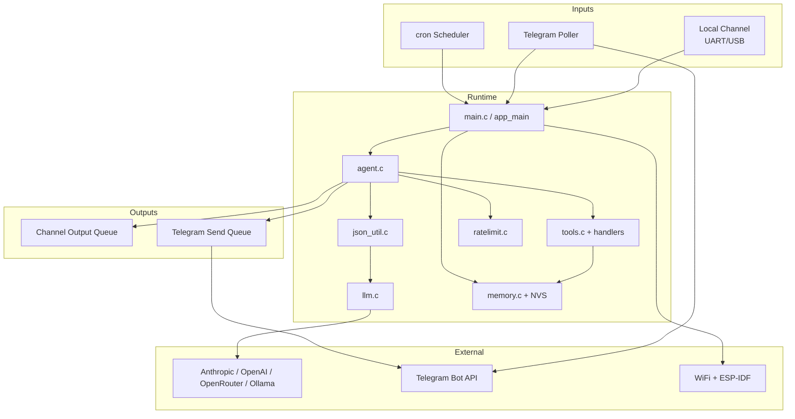
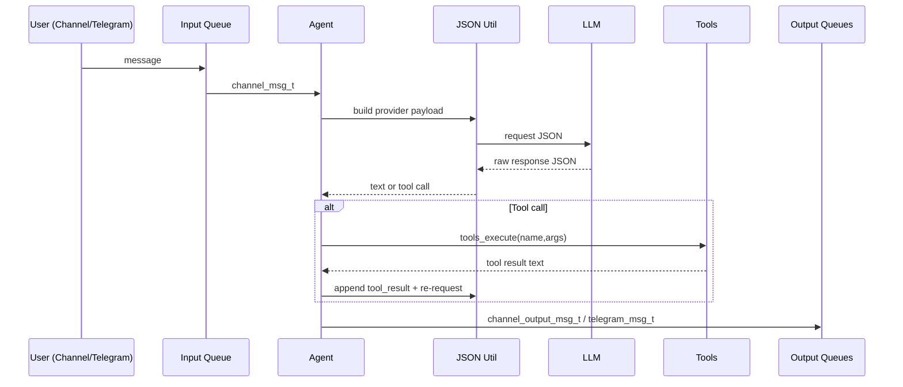
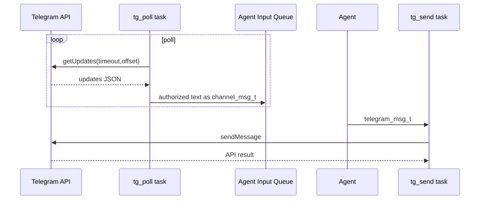
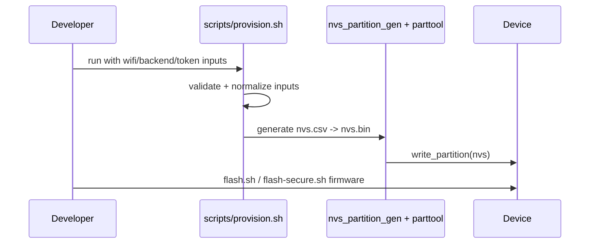

# Codebase Map

> Auto-generated by Cartographer. Last mapped: 2026-03-04T11:17:24Z

## System Overview

`zclaw` is an ESP-IDF firmware project for an on-device assistant that receives messages from local channel/Telegram/cron, calls LLM providers, executes built-in/user tools, and returns responses through queues.



## Directory Structure

```text
.
|- main/                  # Firmware runtime (agent, llm, tools, telegram, cron, storage)
|- scripts/               # Build/flash/provision/test/relay/devops scripts
|- test/
|  |- host/               # Host-side C/Python tests + mocks/shims
|  `- api/                # Live provider harness/integration tests
|- docs-site/             # Static documentation website (HTML/CSS/JS + reference markdown)
|- .github/workflows/     # CI checks, matrix builds, release pipeline
|- docs/images/           # Documentation assets
|- install.sh             # Interactive bootstrap/install orchestrator
|- CMakeLists.txt         # ESP-IDF project entry
|- sdkconfig*.defaults    # Build overlays (default, qemu, secure, board-specific)
`- partitions.csv         # Flash partition layout
```

## Module Guide

### Firmware Runtime (`main/`)

**Purpose**: Core embedded assistant runtime and subsystem orchestration.
**Entry point**: `main/main.c` (`app_main`)

| File | Purpose | Tokens |
|------|---------|--------|
| `main/main.c` | Startup pipeline, mode selection, subsystem wiring | 4898 |
| `main/agent.c` | Message handling, LLM/tool loop, command middleware | 7356 |
| `main/llm.c` | Provider selection/auth/http request path | 6166 |
| `main/json_util.c` | Provider-specific request/response translation | 4414 |
| `main/channel.c` | UART/USB channel tasks + emulator bridge | 3031 |
| `main/config.h` | Global limits/constants/Kconfig-backed defaults | 1914 |

**Exports**:
- Runtime lifecycle APIs: `agent_start`, `channel_start`, `llm_init`, `ratelimit_init`, `memory_init`, `ota_init`
- Queue payload contracts: `channel_msg_t`, `channel_output_msg_t`, `telegram_msg_t`
- Build/runtime configuration via `CONFIG_ZCLAW_*` + `main/config.h`

**Dependencies**:
- ESP-IDF subsystems (`esp_wifi`, `nvs_flash`, `esp_http_client`, FreeRTOS)
- External LLM APIs (Anthropic/OpenAI/OpenRouter/Ollama)
- NVS for runtime state and credentials

**Dependents**:
- `test/host/*.c` suites and mocks
- Scripts and docs that assume tool/runtime behavior

### Scheduling + Telegram + Tools (`main/cron*`, `main/telegram*`, `main/tools*`, `main/user_tools*`)

**Purpose**: Scheduled actions, Telegram integration, built-in tool registry and handler execution.
**Entry points**: `cron_init/cron_start`, `telegram_init/telegram_start`, `tools_init/tools_execute`

| File | Purpose | Tokens |
|------|---------|--------|
| `main/telegram.c` | Poll/send loops, chat allowlist, HTTP/backoff | 7737 |
| `main/cron.c` | Persistent schedule engine + timezone/NTP | 4398 |
| `main/tools_system.c` | Diagnostics/version/user-tool handlers | 3655 |
| `main/tools_cron.c` | Cron/timezone handlers | 3079 |
| `main/tools_gpio.c` | GPIO/delay handlers with safety checks | 2252 |
| `main/user_tools.c` | Dynamic user tool persistence/validation | 2435 |
| `main/builtin_tools.def` | X-macro built-in tool registry | 1743 |

**Exports**:
- Telegram: `telegram_send`, `telegram_is_configured`, `telegram_send_startup`
- Cron: `cron_set/list/delete`, `cron_set_timezone/get_timezone`
- Tool dispatch and handlers for GPIO, memory, cron/time, diagnostics, user tools

**Dependencies**:
- Runtime queues/messages and NVS keys (`NVS_KEY_TG_*`, `NVS_KEY_TIMEZONE`, persona/user tool storage)
- ESP HTTP client and network stack

**Dependents**:
- `agent.c` tool-calling loop
- Telegram/cron inputs into agent queue

### Automation Scripts (`scripts/`)

**Purpose**: Developer and CI operations for build, flash, provision, relay, benchmark, test, and release support.
**Entry points**: `scripts/build.sh`, `scripts/flash*.sh`, `scripts/provision*.sh`, `scripts/test.sh`, `scripts/web-relay.sh`

| File | Purpose | Tokens |
|------|---------|--------|
| `scripts/provision.sh` | Credential validation + NVS generation + write | 9308 |
| `scripts/web_relay.py` | HTTP relay + embedded UI + serial bridge | 8335 |
| `scripts/flash-secure.sh` | Secure flashing/encryption lifecycle | 5581 |
| `scripts/flash.sh` | Standard flashing + target/port guards | 4467 |
| `scripts/benchmark_latency.py` | Relay/serial latency benchmark | 4259 |
| `scripts/emulate.sh` | QEMU run path (incl. live LLM bridge mode) | 1526 |

**Exports**:
- Shell entrypoints for local/CI workflows
- Python utilities for relay, benchmark, qemu bridge, net diagnostics

**Dependencies**:
- ESP-IDF environment (`IDF_PATH`, `idf.py`, toolchain)
- Optional provider keys and relay auth env vars

**Dependents**:
- `.github/workflows/*.yml`
- User onboarding paths in `README.md` and `docs-site/*`

### Tests (`test/`)

**Purpose**: Host C unit/integration tests, Python tests for scripts/API harness, and provider-harness live checks.
**Entry points**: `test/host/test_runner.c`, dedicated runners, `python -m unittest`, `test/api/test_*.py`

| File | Purpose | Tokens |
|------|---------|--------|
| `test/host/test_install_provision_scripts.py` | End-to-end script behavior checks via fake env/tooling | 12257 |
| `test/host/test_agent.c` | Agent orchestration + command/messaging behavior | 6128 |
| `test/api/provider_harness.py` | Multi-provider tool-call conversation harness | 4626 |
| `test/host/test_json_util_integration.c` | JSON adapter integration across backends | 2574 |
| `test/host/test_tools_gpio_policy.c` | GPIO policy/handler behavior | 2309 |

**Exports**:
- `test_*_all` C suites
- Python `unittest` classes and provider CLI harnesses
- Host shims/mocks for ESP-IDF and FreeRTOS APIs

**Dependencies**:
- Runtime headers and interfaces from `main/`
- cJSON/host compiler/runtime

**Dependents**:
- `scripts/test.sh`
- `host-tests.yml`

### Documentation + Meta (`docs-site/`, root docs, workflows)

**Purpose**: Static docs site, changelog/release metadata, CI/CD policy.
**Entry points**: `docs-site/index.html`, `README.md`, `.github/workflows/release.yml`

| File | Purpose | Tokens |
|------|---------|--------|
| `docs-site/reference/README_COMPLETE.md` | Canonical long-form operational reference | 7084 |
| `docs-site/styles.css` | Shared docs-site design system and themes | 5080 |
| `docs-site/app.js` | Theme/nav/shortcut interactivity | 3088 |
| `install.sh` | Interactive bootstrap orchestrator | 10891 |
| `.github/workflows/release.yml` | Manual version bump/tag/release pipeline | 1077 |

**Dependencies**:
- Scripts under `scripts/`
- GitHub Actions and ESP-IDF container images

**Dependents**:
- End-user onboarding and release process

## Entry Points

| Entry Point | File | Description |
|-------------|------|-------------|
| Firmware app start | `main/main.c` | `app_main` initializes storage/network/subsystems and starts tasks |
| Agent runtime start | `main/agent.c` | `agent_start` consumes inbound queue and orchestrates LLM/tools |
| Telegram runtime start | `main/telegram.c` | Poll/send task startup and chat routing |
| Cron runtime start | `main/cron.c` | Scheduler initialization and periodic due-check loop |
| Tool dispatch | `main/tools.c` | Name-based dispatch into handler modules |
| Build command | `scripts/build.sh` | Build + optional board preset/padding |
| Flash command | `scripts/flash.sh` | Standard flash path with safety checks |
| Secure flash command | `scripts/flash-secure.sh` | Encrypted flash flow |
| Provision command | `scripts/provision.sh` | NVS credentials setup and write |
| Test command | `scripts/test.sh` | Host/device test orchestration |
| Docs serve | `scripts/docs-site.sh` | Local static docs preview |

## Data Models & Schema

- Queue message contracts (`main/messages.h`):
  - `channel_msg_t`: inbound message + source + optional `chat_id`
  - `channel_output_msg_t`: outbound local channel text
  - `telegram_msg_t`: outbound telegram text + optional `reply_chat_id`
- Conversation model (`main/json_util.h`):
  - `conversation_msg_t` with role/content/tool metadata
- Tool model:
  - Built-ins via `TOOL_ENTRY` registry in `main/builtin_tools.def`
  - Dynamic user tools via `user_tool_t` (`main/user_tools.h`)
- Cron model (`main/cron.h`):
  - `cron_entry_t` with `id`, `type`, `action`, schedule fields, and `last_run`
- Persistent keyspace (`main/nvs_keys.h`):
  - WiFi, LLM backend/model/API key/url, Telegram token/chat IDs, timezone/persona, rate-limit counters

## External Integrations

| Service | Purpose | Config Location |
|---------|---------|-----------------|
| ESP-IDF SDK | Firmware build/runtime primitives | `CMakeLists.txt`, `main/CMakeLists.txt`, `sdkconfig*.defaults` |
| WiFi + NVS + FreeRTOS | Connectivity, storage, tasking/queues | `main/main.c`, `main/memory.c`, `main/messages.h` |
| Anthropic API | LLM backend | `main/llm.c`, `test/api/provider_harness.py`, env `ANTHROPIC_*` |
| OpenAI API | LLM backend | `main/llm.c`, `test/api/provider_harness.py`, env `OPENAI_*` |
| OpenRouter API | LLM backend | `main/llm.c`, env `OPENROUTER_*` |
| Ollama API | Local/hosted LLM backend | `main/llm.c`, env `OLLAMA_*` |
| Telegram Bot API | Remote message transport | `main/telegram.c`, NVS keys `NVS_KEY_TG_*` |
| GitHub Actions | CI guards and release automation | `.github/workflows/*.yml` |
| QEMU | Emulator runtime | `scripts/emulate.sh`, `scripts/qemu_live_llm_bridge.py` |

## Data Flow

### Runtime Request Flow



### Telegram Poll/Send Flow



### Provisioning/Flash Flow



## Conventions

- Explicit source registration in `main/CMakeLists.txt`; no source globbing.
- Compile-time feature gates and defaults via `CONFIG_ZCLAW_*` and `main/config.h`.
- Queue-oriented concurrency boundary between subsystems.
- Tool registry pattern:
  - Built-in tools via X-macro (`builtin_tools.def`)
  - Dynamic tools persisted by `user_tools.c`
- Shell scripts enforce guardrails for serial port usage, target selection, and secure-flash paths.
- Host tests rely heavily on mocks/shims under `test/host/`.

## Gotchas

- `main/ota.c` falls back to hardcoded version string `2.5.3` when compile-time version define is unavailable.
- `main/telegram.c` polls with `limit=1`; backlog clears one update per cycle.
- `main/telegram.c` response buffer is fixed size (4096); truncation triggers best-effort update-id recovery.
- `main/tools_i2c.c` reinitializes/deletes `I2C_NUM_0` each scan, which can disrupt shared I2C state.
- `main/user_tools.c` persists struct blobs directly; schema/layout changes can break compatibility.
- `main/ratelimit.c` persists daily counter only; hourly counter resets on reboot.
- `scripts/flash.sh` intentionally blocks encrypted devices and requires `scripts/flash-secure.sh`.
- `scripts/check-stack-usage.sh` uses `eval` on compile commands extracted from `compile_commands.json`.

## Navigation Guide

**To add a new built-in tool**:
1. Add registry entry in `main/builtin_tools.def`
2. Add handler declaration in `main/tools_handlers.h`
3. Implement handler in the relevant `main/tools_*.c`
4. Ensure dispatch includes it via `main/tools.c`
5. Add/update tests in `test/host/test_tools_*.c`

**To add a new user dynamic-tool capability**:
1. Extend validation/storage in `main/user_tools.c`
2. Update management handlers in `main/tools_system.c`
3. Update docs in `docs-site/tools.html` and reference docs

**To change LLM provider behavior**:
1. Modify backend policy in `main/llm.c`
2. Adjust JSON adapters in `main/json_util.c`
3. Update provider tests in `test/api/` and `test/host/test_json_util_integration.c`

**To modify Telegram behavior**:
1. `main/telegram.c` for poll/send/runtime behavior
2. `main/telegram_chat_ids.*`, `main/telegram_update.*`, `main/telegram_poll_policy.*`
3. Update tests `test/host/test_telegram_*.c`

**To modify provisioning/flash workflow**:
1. `scripts/provision.sh`, `scripts/provision-dev.sh`
2. `scripts/flash.sh` and `scripts/flash-secure.sh`
3. Script integration tests in `test/host/test_install_provision_scripts.py`

**To tune safety/limits/config defaults**:
1. `main/config.h`
2. `main/Kconfig.projbuild`
3. `sdkconfig*.defaults`
4. Add/adjust tests for new limits
