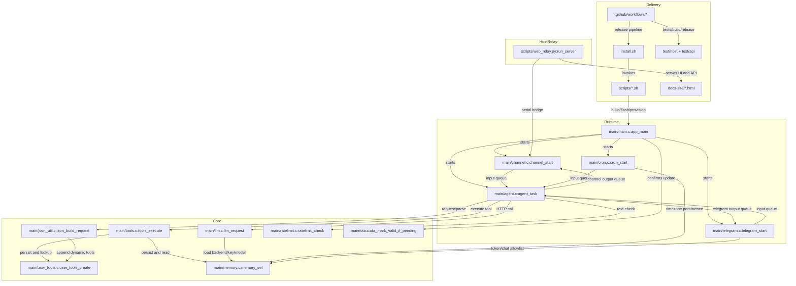
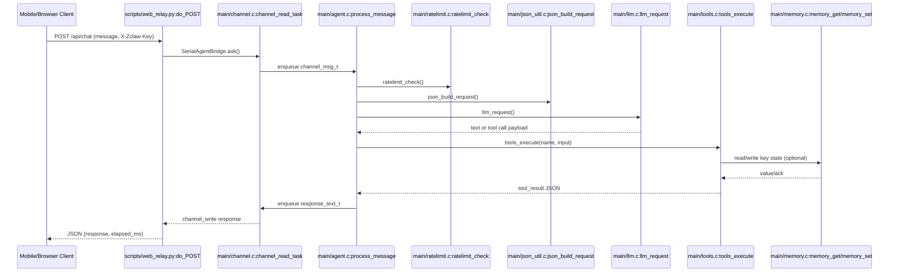

# zclaw.TW

> Not a cloud multi-tenant agent platform; it is ESP32 firmware plus host tooling for local and Telegram tool-calling automation with persisted device state.

| Field | Value |
|-------|-------|
| **Language** | C (37.3% by tokens), Shell (21.4%) |
| **Framework** | None detected by scanner (source includes ESP-IDF and FreeRTOS) |
| **Package Manager** | None detected |
| **Version** | 2.10.1 (`VERSION`) |
| **License** | MIT (`LICENSE`) |
| **Dependencies** | 0 direct |
| **First Commit** | 2026-02-20T13:17:29-08:00 |
| **Contributors** | 2 |
| **Releases** | 0 |
| **Maturity** | experimental |
| **Stars / Forks** | 0 / 0 |
| **Monthly Downloads** | N/A |
| **CI** | github-actions |
| **Tests** | Yes |
| **Docker** | No |

---

## 2. Architecture

> Embedded runtime with queue-mediated fan-in from serial, Telegram, and cron into one agent loop, then tool execution and response fan-out.

> See [CODEBASE_MAP.md](docs/CODEBASE_MAP.md) for complete directory structure.

### 2.1 System Topology

### 2.1b Module Dependencies (structured)

> Machine-parseable dependency list for LLM readers.

- **MainRuntime** (`main/main.c`): imports [`channel_start`, `agent_start`, `telegram_start`, `cron_start`, `ota_mark_valid_if_pending`, `llm_init`].
- **ChannelTransport** (`main/channel.c`): imports [`messages.h`, `freertos/queue.h`, `channel_start`].
- **TelegramTransport** (`main/telegram.c`): imports [`memory_get`, `telegram_poll_task`, `telegram_send_task`, `is_chat_authorized`].
- **AgentLoop** (`main/agent.c`): imports [`json_build_request`, `llm_request`, `tools_execute`, `ratelimit_check`, `ratelimit_record_request`].
- **LLMRuntime** (`main/llm.c`): imports [`memory_get`, `llm_get_api_url`, `llm_request`].
- **JsonCodec** (`main/json_util.c`): imports [`build_openai_request`, `build_anthropic_request`, `user_tools_get_all`].
- **ToolRegistry** (`main/tools.c`): imports [`builtin_tools.def`, `s_tools`, `tools_execute`, `user_tools_count`].
- **DynamicTools** (`main/user_tools.c`): imports [`MAX_DYNAMIC_TOOLS`, `user_tools_create`, `user_tools_delete`, `user_tools_find`].
- **Persistence** (`main/memory.c`): imports [`memory_set`, `memory_get`, `memory_delete`].
- **Scheduler** (`main/cron.c`): imports [`cron_start`, `cron_set`, `memory_set`, `memory_get`].
- **RateLimit** (`main/ratelimit.c`): imports [`RATELIMIT_MAX_PER_HOUR`, `RATELIMIT_MAX_PER_DAY`, `ratelimit_check`, `ratelimit_record_request`].
- **Installer** (`install.sh`): imports [`scripts/flash.sh`, `scripts/flash-secure.sh`, `scripts/provision.sh`, `scripts/monitor.sh`].
- **WebRelay** (`scripts/web_relay.py`): imports [`SerialAgentBridge`, `MockAgentBridge`, `run_server`, `is_post_origin_allowed`].
- **CI.HostTests** (`.github/workflows/host-tests.yml`): imports [`./scripts/test.sh host`].
- **CI.TargetMatrix** (`.github/workflows/firmware-target-matrix.yml`): imports [`idf.py`, `sdkconfig.defaults`, `sdkconfig.esp32s3-box-3.defaults`].

### 2.2 Layer Boundaries

| Layer | Modules | Responsibility |
|-------|---------|---------------|
| Device boot and orchestration | `main/main.c`, `main/boot_guard.c`, `main/ota.c` | Initialize runtime, guard boot loops, and confirm OTA validity. |
| Ingress and egress channels | `main/channel.c`, `main/telegram.c`, `scripts/web_relay.py` | Accept user messages, enforce channel-level checks, and return responses. |
| Agent execution pipeline | `main/agent.c`, `main/messages.h`, `main/llm.c`, `main/json_util.c`, `main/ratelimit.c` | Build requests, call model APIs, run tool rounds, and enforce quotas. |
| Tool and persistent state | `main/tools.c`, `main/tools_handlers.h`, `main/tools_*.c`, `main/user_tools.c`, `main/memory.c`, `main/nvs_keys.h`, `main/cron.c` | Register tools, execute handlers, store runtime state, and manage schedules. |
| Delivery and verification | `install.sh`, `scripts/*.sh`, `.github/workflows/*`, `test/host/*`, `test/api/*` | Provision devices, run host/device checks, and enforce release/build gates. |

### 2.3 Data Flow

### 2.3b Data Flow (structured)

> Machine-parseable data flow for LLM readers.

1. **Relay Chat Round Trip**: `scripts/web_relay.py:do_POST` → `scripts/web_relay.py:SerialAgentBridge.ask` → `main/channel.c:channel_read_task` → `main/agent.c:process_message` → `main/json_util.c:json_build_request` → `main/llm.c:llm_request` → `main/tools.c:tools_execute` → `main/channel.c:channel_write_task`.
2. **Telegram Poll to Response**: `main/telegram.c:telegram_poll` → `main/telegram.c:is_chat_authorized` → `main/agent.c:process_message` → `main/tools.c:tools_execute` → `main/telegram.c:telegram_send_to_chat`.
3. **Scheduled Action Execution**: `main/cron.c:cron_task` → `main/cron.c:check_entries` → `main/agent.c:process_message` → `main/tools.c:tools_execute`.

---

## 3. Core Abstractions

> 15 core types and modules identified (ranked by architectural significance and fan-in).

### llm_backend_t

| Field | Value |
|-------|-------|
| **Purpose** | Runtime backend selection for endpoint, auth, and wire format. |
| **Defined in** | `main/config.h:llm_backend_t` |
| **Type** | enum |
| **Methods/Fields** | 4 public values |
| **Adapters/Implementations** | 4 (`main/llm.c:llm_get_api_url`, `main/json_util.c:json_build_request` branches for Anthropic, OpenAI, OpenRouter, Ollama) |
| **Used by** | 23 files |

### memory module

| Field | Value |
|-------|-------|
| **Purpose** | Persistent key-value facade over NVS. |
| **Defined in** | `main/memory.h:memory_set` |
| **Type** | function module |
| **Methods/Fields** | 4 public functions |
| **Adapters/Implementations** | 1 (`main/memory.c:memory_init`, `main/memory.c:memory_set`, `main/memory.c:memory_get`, `main/memory.c:memory_delete`) |
| **Used by** | 10 files |

### NVS_KEY_* schema

| Field | Value |
|-------|-------|
| **Purpose** | Shared canonical key names for persisted runtime state. |
| **Defined in** | `main/nvs_keys.h:NVS_KEY_BOOT_COUNT` |
| **Type** | constants |
| **Methods/Fields** | 15 key constants |
| **Adapters/Implementations** | 0 (interface-only constants) |
| **Used by** | 10 files |

### Tool handler interface

| Field | Value |
|-------|-------|
| **Purpose** | Stable function contract for executable tools. |
| **Defined in** | `main/tools_handlers.h:tools_gpio_write_handler` |
| **Type** | interface-by-convention |
| **Methods/Fields** | 24 handler signatures |
| **Adapters/Implementations** | 6 modules (`main/tools_gpio.c`, `main/tools_i2c.c`, `main/tools_memory.c`, `main/tools_persona.c`, `main/tools_cron.c`, `main/tools_system.c`) |
| **Used by** | 7 files |

### channel_msg_t

| Field | Value |
|-------|-------|
| **Purpose** | Unified envelope for channel, Telegram, and cron input. |
| **Defined in** | `main/messages.h:channel_msg_t` |
| **Type** | struct |
| **Methods/Fields** | 3 fields |
| **Adapters/Implementations** | 3 producers (`main/channel.c:channel_read_task`, `main/telegram.c:telegram_poll`, `main/cron.c:check_entries`) |
| **Used by** | 5 files |

### tools registry and dispatcher

| Field | Value |
|-------|-------|
| **Purpose** | Resolve tool names and dispatch handler execution. |
| **Defined in** | `main/tools.h:tools_execute` |
| **Type** | function module |
| **Methods/Fields** | 3 public functions |
| **Adapters/Implementations** | 24 built-ins from `main/builtin_tools.def:TOOL_ENTRY` into `main/tools.c:s_tools` |
| **Used by** | 4 files |

### user_tools module

| Field | Value |
|-------|-------|
| **Purpose** | Persist and query user-defined tool definitions. |
| **Defined in** | `main/user_tools.h:user_tools_create` |
| **Type** | function module |
| **Methods/Fields** | 7 public functions |
| **Adapters/Implementations** | 1 (`main/user_tools.c:user_tools_create`, `main/user_tools.c:user_tools_delete`, `main/user_tools.c:user_tools_find`) |
| **Used by** | 4 files |

### llm module

| Field | Value |
|-------|-------|
| **Purpose** | Send backend-aware LLM HTTP requests and return payloads. |
| **Defined in** | `main/llm.h:llm_request` |
| **Type** | function module |
| **Methods/Fields** | 8 public functions |
| **Adapters/Implementations** | 3 paths (`main/llm.c:llm_request` bridge, stub, HTTPS) |
| **Used by** | 4 files |

### cron module

| Field | Value |
|-------|-------|
| **Purpose** | Store, evaluate, and trigger scheduled actions. |
| **Defined in** | `main/cron.h:cron_set` |
| **Type** | function module |
| **Methods/Fields** | 10 public functions |
| **Adapters/Implementations** | 1 (`main/cron.c:cron_start`, `main/cron.c:cron_task`, `main/cron.c:check_entries`) |
| **Used by** | 3 files |

### ratelimit module

| Field | Value |
|-------|-------|
| **Purpose** | Enforce hourly and daily request quotas. |
| **Defined in** | `main/ratelimit.h:ratelimit_check` |
| **Type** | function module |
| **Methods/Fields** | 6 public functions |
| **Adapters/Implementations** | 1 (`main/ratelimit.c:ratelimit_check`, `main/ratelimit.c:ratelimit_record_request`) |
| **Used by** | 3 files |

### channel module

| Field | Value |
|-------|-------|
| **Purpose** | Handle serial ingress and egress transport. |
| **Defined in** | `main/channel.h:channel_start` |
| **Type** | function module |
| **Methods/Fields** | 4 public functions |
| **Adapters/Implementations** | 2 (`main/channel.c:channel_read_task`, `main/channel.c:channel_write_task`) |
| **Used by** | 2 files |

### ota lifecycle module

| Field | Value |
|-------|-------|
| **Purpose** | Track pending firmware verification and rollback state. |
| **Defined in** | `main/ota.h:ota_mark_valid_if_pending` |
| **Type** | function module |
| **Methods/Fields** | 6 public functions |
| **Adapters/Implementations** | 1 (`main/ota.c:ota_mark_valid_if_pending`) |
| **Used by** | 2 files |

### agent module

| Field | Value |
|-------|-------|
| **Purpose** | Orchestrate conversation loop, tool rounds, and responses. |
| **Defined in** | `main/agent.h:agent_start` |
| **Type** | function module |
| **Methods/Fields** | 1 public start function |
| **Adapters/Implementations** | 1 (`main/agent.c:process_message`, `main/agent.c:agent_task`) |
| **Used by** | 1 file |

### telegram module

| Field | Value |
|-------|-------|
| **Purpose** | Poll Telegram updates and send outbound messages. |
| **Defined in** | `main/telegram.h:telegram_start` |
| **Type** | function module |
| **Methods/Fields** | 6 public functions |
| **Adapters/Implementations** | 1 (`main/telegram.c:telegram_poll_task`, `main/telegram.c:telegram_send_task`) |
| **Used by** | 1 file |

### json_util codec module

| Field | Value |
|-------|-------|
| **Purpose** | Build and parse backend-specific LLM JSON payloads. |
| **Defined in** | `main/json_util.h:json_build_request` |
| **Type** | function module |
| **Methods/Fields** | 3 public functions |
| **Adapters/Implementations** | 2 (`main/json_util.c:build_anthropic_request`, `main/json_util.c:build_openai_request`) |
| **Used by** | 1 file |

---

## 4. [CONDITIONAL SECTIONS]

> Scanner detected no optional sections directly; subagent cross-reference found queue-based concurrency patterns, so scalability and concurrency sections are included.

- [ ] Storage Layer — scanner not detected
- [ ] Embedding Pipeline — scanner not detected
- [ ] Infrastructure Layer — scanner not detected
- [ ] Knowledge Graph — scanner not detected
- [x] Scalability — Agent A/B reported queue-driven task fan-in/fan-out
- [x] Concurrency & Multi-Agent — Agent A/B reported task orchestration primitives

### 4.5 Scalability

| Component | Detail |
|-----------|--------|
| **Queue** | FreeRTOS queues via `xQueueSend`/`xQueueReceive` (`main/agent.c:agent_task`, `main/channel.c:channel_read_task`, `main/telegram.c:telegram_poll`) |
| **Workers** | 7 runtime task types (`main/agent.c:agent_task`, `main/channel.c:channel_read_task`, `main/channel.c:channel_write_task`, `main/cron.c:cron_task`, `main/telegram.c:telegram_poll_task`, `main/telegram.c:telegram_send_task`, `main/main.c:clear_boot_count`) |
| **Sharding** | N/A |

### 4.6 Concurrency & Multi-Agent

| Component | Detail |
|-----------|--------|
| **Pattern** | RTOS task orchestration with queue handoff |
| **Concurrency primitives** | `xTaskCreate`, `xQueueSend`, `xQueueReceive` (`main/main.c:app_main`, `main/agent.c:agent_task`, `main/channel.c:channel_start`, `main/telegram.c:telegram_start`, `main/cron.c:cron_start`) |
| **Agent count** | 1 runtime agent type (`main/agent.c:agent_task`) |

---

## 5. Usage Guide

> 6 consumption interfaces identified across firmware channels, host relay/API, scripts, and static docs.

### 5.1 Consumption Interfaces

| Interface | Entry Point | Example |
|-----------|------------|---------|
| Serial chat channel | `main/channel.c:channel_start` | `./scripts/benchmark.sh --mode serial --serial-port /dev/cu.usbmodem1101 --count 20 --message "ping"` |
| Telegram bot interface | `main/telegram.c:telegram_start` | Provision token/chat IDs, then send a bot message to trigger `main/telegram.c:telegram_poll`. |
| Hosted relay REST + UI | `scripts/web_relay.py:run_server` | `./scripts/web-relay.sh` then use `/api/chat` from the served page. |
| Installer/provision CLI | `install.sh:parse_args` | `./install.sh -y` and `./scripts/provision.sh` for non-interactive setup. |
| Live provider harness CLI | `test/api/provider_harness.py:run_conversation` | `python test/api/test_openai.py` or `python test/api/test_anthropic.py` for provider checks. |
| Static documentation site | `docs-site/index.html` | Open `docs-site/index.html` or hosted `zclaw.dev` pages (10 HTML files). |

### 5.2 Configuration

| Config Source | Path | Key Settings |
|--------------|------|-------------|
| Build/runtime constants | `main/config.h` | `MAX_TOOL_ROUNDS`, `LLM_MAX_RETRIES`, `INPUT_QUEUE_LENGTH`, `OUTPUT_QUEUE_LENGTH`, `RATELIMIT_MAX_PER_HOUR`, `RATELIMIT_MAX_PER_DAY`, `MAX_DYNAMIC_TOOLS` |
| Persisted key namespace | `main/nvs_keys.h` | `NVS_KEY_API_KEY`, `NVS_KEY_LLM_BACKEND`, `NVS_KEY_LLM_MODEL`, `NVS_KEY_TG_TOKEN`, `NVS_KEY_TG_CHAT_IDS`, `NVS_KEY_TIMEZONE` |
| Target defaults | `sdkconfig.defaults`, `sdkconfig.esp32s3-box-3.defaults`, `sdkconfig.qemu.defaults`, `sdkconfig.test` | IDF target, GPIO policy pins, emulator stubs, test overlays |
| Secure overlay | `sdkconfig.secure`, `partitions.csv` | `CONFIG_SECURE_FLASH_ENC_ENABLED`, `CONFIG_NVS_ENCRYPTION`, custom partition table with `nvs_key` and OTA slots |
| Relay runtime config | `scripts/web_relay.py:parse_args` | `--port`, `--cors-origin`, `--serial-port`, `--api-key`, `--bridge-timeout` |

### 5.3 Deployment Modes

| Mode | How | Prerequisites |
|------|-----|--------------|
| Local firmware flash | `./scripts/build.sh` then `./scripts/flash.sh` | ESP-IDF toolchain, connected ESP32 board |
| Secure flash mode | `./scripts/flash-secure.sh` with secure sdkconfig overlay | Board support for flash/NVS encryption, secure partition config |
| QEMU emulator mode | `./scripts/emulate.sh` and optional `scripts/qemu_live_llm_bridge.py:main` | QEMU toolchain, emulator sdkconfig defaults |
| Hosted relay mode | `./scripts/web-relay.sh` (wraps `scripts/web_relay.py:main`) | Host serial access and optional API key/origin config |
| CI target matrix builds | `.github/workflows/firmware-target-matrix.yml` | GitHub Actions runner with `espressif/idf:v5.4` |

### 5.4 AI Agent Integration

| Pattern | Detail |
|---------|--------|
| **Protocol** | OpenAI function-calling and Anthropic tool-use request formats (`main/json_util.c:build_openai_request`, `main/json_util.c:build_anthropic_request`) |
| **Tools exposed** | 24 built-in tools (`main/builtin_tools.def:TOOL_ENTRY`) plus up to 8 user-defined tools (`main/config.h:MAX_DYNAMIC_TOOLS`) |
| **Entry point** | `main/agent.c:process_message` dispatches tool loops through `main/tools.c:tools_execute` |

---

## 6. Performance & Cost

> Cost is dominated by LLM round-trips and retry loops; queue sizes and quotas are compile-time constrained.

| Metric | Value | Source |
|--------|-------|--------|
| LLM calls per request | 1 to 15 attempts (`MAX_TOOL_ROUNDS=5` × `LLM_MAX_RETRIES=3`) | `main/config.h:MAX_TOOL_ROUNDS`, `main/config.h:LLM_MAX_RETRIES`, `main/agent.c:process_message` |
| Conversation history window | 12 user/assistant turns (24 messages) | `main/config.h:MAX_HISTORY_TURNS`, `main/agent.c:history_add` |
| Cache strategy | No response cache; rolling in-memory history with rollback markers | `main/agent.c:s_history`, `main/agent.c:history_rollback_to` |
| Rate limiting | 100 requests/hour and 1000/day with NVS-backed counters | `main/config.h:RATELIMIT_MAX_PER_HOUR`, `main/config.h:RATELIMIT_MAX_PER_DAY`, `main/ratelimit.c:ratelimit_record_request` |
| Queue backpressure limits | input 8, channel output 8, Telegram output 4 | `main/config.h:INPUT_QUEUE_LENGTH`, `main/config.h:OUTPUT_QUEUE_LENGTH`, `main/config.h:TELEGRAM_OUTPUT_QUEUE_LENGTH` |

---

## 7. Security & Privacy

> Channel auth and key scope checks are explicit; storage confidentiality depends on whether secure flash config is used.

| Aspect | Detail |
|--------|--------|
| **API Key Management** | LLM API key loaded from NVS key `NVS_KEY_API_KEY` (`main/llm.c:llm_init`), relay request key checked via `X-Zclaw-Key` (`scripts/web_relay.py:do_POST`). |
| **Auth Pattern** | Telegram allowlist gate via `main/telegram.c:is_chat_authorized`; relay key gate via `scripts/web_relay.py:normalize_api_key` + `scripts/web_relay.py:do_POST`. |
| **Data at Rest** | Plain NVS by default; encrypted NVS and flash when secure overlay is used (`sdkconfig.secure:CONFIG_NVS_ENCRYPTION`, `sdkconfig.secure:CONFIG_SECURE_FLASH_ENC_ENABLED`). |
| **PII Handling** | Chat IDs are persisted and compared for authorization; no anonymization path detected (`main/telegram.c:set_allowed_chat_ids_from_string`, `main/telegram.c:is_chat_authorized`). |
| **CORS** | Exact-origin allow mode is optional, default origin allow is disabled (`scripts/web_relay.py:is_cors_origin_allowed`, `scripts/web_relay.py:run_server`). |

---

## 8. Design Decisions

> 5 architectural decisions shape runtime behavior, backend interoperability, and operational safety boundaries.

### 8.1 Queue-Decoupled Runtime Pipeline

| Aspect | Detail |
|--------|--------|
| **Problem** | Serial, Telegram, and cron producers must continue while model calls block. |
| **Choice** | Independent FreeRTOS tasks with queue handoff between producers and the agent loop. |
| **Alternatives** | Direct synchronous cross-module calls were not chosen because blocking model I/O in `main/agent.c:process_message` would stall ingress paths. |
| **Tradeoffs** | Gains producer isolation; loses guaranteed delivery when queues fill (`xQueueSend` failures need explicit handling). |
| **Evidence** | `main/main.c:app_main` starts `main/channel.c:channel_start`, `main/telegram.c:telegram_start`, `main/cron.c:cron_start`, and `main/agent.c:agent_start`. |

### 8.2 Runtime Multi-Provider LLM Strategy

| Aspect | Detail |
|--------|--------|
| **Problem** | Providers require different API URLs, auth headers, and payload formats. |
| **Choice** | Runtime backend enum plus dual request/parse branches selected per backend. |
| **Alternatives** | Compile-time single backend was not chosen because backend value is loaded from persisted config (`main/llm.c:llm_init`). |
| **Tradeoffs** | Gains runtime backend switching; loses simplicity due repeated backend branching across modules. |
| **Evidence** | `main/config.h:llm_backend_t`, `main/llm.c:llm_get_api_url`, `main/json_util.c:json_build_request`. |

### 8.3 X-Macro Tool Registry

| Aspect | Detail |
|--------|--------|
| **Problem** | Tool schema and dispatch lists can drift if maintained in separate files. |
| **Choice** | One source-of-truth `TOOL_ENTRY` list expanded into a static registry array. |
| **Alternatives** | Manual switch/parallel arrays were not chosen because each tool addition would require multi-file updates. |
| **Tradeoffs** | Gains consistency and lower drift risk; loses readability for readers unfamiliar with macro expansion. |
| **Evidence** | `main/builtin_tools.def:TOOL_ENTRY`, `main/tools.c:s_tools`, `main/tools.c:tools_execute`. |

### 8.4 Fail-Closed Authorization and Memory Scoping

| Aspect | Detail |
|--------|--------|
| **Problem** | Untrusted chat IDs or unrestricted key access can trigger device actions or expose secrets. |
| **Choice** | Telegram allowlist checks plus user-key prefix and sensitive-key blocks in memory tool handlers. |
| **Alternatives** | Accepting first-seen chat IDs and unrestricted memory keys were not chosen due explicit unauthorized rejection logic. |
| **Tradeoffs** | Gains stricter control of remote commands and key scope; loses frictionless initial setup. |
| **Evidence** | `main/telegram.c:is_chat_authorized`, `main/tools_memory.c:tools_memory_set_handler`, `main/memory_keys.c:memory_keys_is_sensitive`. |

### 8.5 Boot-Loop Guard with Delayed OTA Confirmation

| Aspect | Detail |
|--------|--------|
| **Problem** | Faulty images can cause restart loops and repeated unstable boots. |
| **Choice** | Persist boot count, gate safe mode on threshold, and confirm OTA only after stable uptime. |
| **Alternatives** | Immediate OTA validity marking and no boot-failure counter were not chosen because rollback safety would weaken. |
| **Tradeoffs** | Gains stronger post-update recovery behavior; loses immediate OTA confirmation and adds extra persistence writes. |
| **Evidence** | `main/boot_guard.c:boot_guard_should_enter_safe_mode`, `main/main.c:clear_boot_count`, `main/ota.c:ota_mark_valid_if_pending`. |

---

## 8.5 Code Quality & Patterns

> Error handling, logging, and testing are implemented across shell, C, and Python layers with mixed strictness in typing.

| Aspect | Detail |
|--------|--------|
| **Error Handling** | Shell uses fail-fast (`install.sh:set -e`, `.github/workflows/release.yml:set -euo pipefail`); C tests use ASSERT-return patterns (`test/host/test_agent.c:ASSERT`); provider harness catches transport failures (`test/api/provider_harness.py:call_api`). |
| **Logging** | Shell wrappers emit status levels (`install.sh:print_status`, `install.sh:print_warning`, `install.sh:print_error`); firmware/tests use `printf` and ESP log macros (`test/host/test_runner.c:main`, `test/host/mock_esp.h:ESP_LOGI`). |
| **Testing** | 57 files under `test/`; 28 `test_*` files in this profile scope (20 C, 8 Python), combining host runners and API provider tests (`test/host/test_runner.c:main`, `test/host/test_ratelimit_runner.c:main`, `test/api/test_tool_creation.py:main`). |
| **Type Safety** | Partial: C interfaces are statically typed (`main/tools.h:tool_execute_fn`, `test/host/mock_freertos.c:xQueueCreate`), Python uses annotations/dataclass (`test/api/provider_harness.py:ProviderConfig`), shell/YAML remain untyped (`install.sh`, `.github/workflows/*.yml`). |

---

## 9. Recommendations

> 4 actionable improvements prioritized by risk of dropped actions, persistence churn, policy drift, and backend extension overhead.

### 9.1 Add Queue Drop Telemetry and Retry Path

| Aspect | Detail |
|--------|--------|
| **Current State** | `main/channel.c:channel_read_task`, `main/telegram.c:telegram_poll`, and `main/cron.c:check_entries` send to queues without a durable retry/dead-letter path. |
| **Problem** | Burst traffic can drop commands or scheduled actions when queues are full. |
| **Suggested Fix** | Add per-queue drop counters and max-depth counters to diagnostics (`main/tools_system.c:tools_get_diagnostics_handler`), then add bounded retry or dead-letter buffering for failed enqueue events. |
| **Expected Effect** | Produces measurable overload visibility and reduces silent action loss under burst conditions. |

### 9.2 Batch Rate-Limit Persistence Writes

| Aspect | Detail |
|--------|--------|
| **Current State** | Each accepted model request writes counters in `main/ratelimit.c:ratelimit_record_request` through `memory_set`. |
| **Problem** | Write frequency scales linearly with request volume and increases flash wear risk. |
| **Suggested Fix** | Persist on bounded batch intervals, plus on controlled shutdown and critical checkpoints. |
| **Expected Effect** | Lowers NVS write count by a bounded factor while keeping quota enforcement semantics. |

### 9.3 Centralize GPIO Allowlist Policy

| Aspect | Detail |
|--------|--------|
| **Current State** | GPIO allow checks are duplicated in `main/tools_gpio.c:gpio_pin_is_allowed` and `main/tools_i2c.c:gpio_pin_is_allowed`. |
| **Problem** | Policy changes can diverge between GPIO and I2C handlers. |
| **Suggested Fix** | Extract shared policy helpers (`is_allowed`, CSV parsing, deny reasons) into one module and reuse from both handlers. |
| **Expected Effect** | Single policy source and reduced regression surface for safety checks. |

### 9.4 Replace Backend Branching with Descriptor Table

| Aspect | Detail |
|--------|--------|
| **Current State** | Backend-specific branches are spread across `main/llm.c` and `main/json_util.c`. |
| **Problem** | Adding a backend requires edits in multiple functions and files. |
| **Suggested Fix** | Introduce a backend descriptor table with URL, auth header strategy, request builder, and response parser function pointers. |
| **Expected Effect** | New backend onboarding becomes a single descriptor addition with reduced branching edits. |
