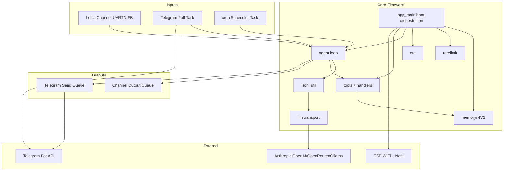
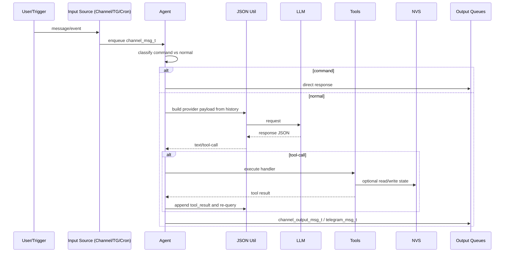

# zclaw.TW
## Reverse-Engineered Product & Technical Specification

- **Analysis mode**: Full project (auto-selected because `main...HEAD` diff is empty)
- **Branch**: `main`
- **Generated at**: 2026-03-04T12:25:34Z
- **Scope**: `181` tracked files, `3,062,929` bytes (~`765,732` tokens)

## 1. Problem Statement

This repository ships a full embedded assistant platform (firmware + provisioning + secure flashing + relay + tests + docs), but the implementation is spread across C firmware modules, many shell/Python operational scripts, and host-side shims/tests. Without a reverse-engineered spec, onboarding and change planning are high-friction, and product/runtime invariants are hard to evaluate consistently.

## 2. Solution Overview

The solution is a layered system:

1. **Firmware runtime (`main/`)**
: ESP-IDF app with queue-driven agent orchestration, LLM provider abstraction, tool execution, Telegram integration, cron scheduling, OTA state, and persistence.
2. **Operational tooling (`scripts/`)**
: Build/flash/provision/test/relay/emulation CLIs with strong safety checks and secure-flash lifecycle support.
3. **Validation (`test/`)**
: Host C tests with mocks, Python unittest suites for scripts/relay, and live provider harness tests.
4. **Delivery/docs (`.github/workflows`, `docs-site/`, root docs/config)**
: CI quality gates, release automation, and static product documentation.

Design properties observed in code:

- Queue/task decoupling between input sources and response sinks.
- Runtime configurability from NVS (backend/model/api URL/persona/timezone/chat IDs).
- Safety-first operations (rate limits, chat allowlist, flash-encryption-aware paths, guarded erase/reset).
- Explicit boundedness (fixed queues/buffers, max tools/cron entries, capped retry rounds).

## 3. Product Requirements

### 3.1 User-Facing Behavior

| ID | Requirement | Evidence in code/tests |
|---|---|---|
| REQ-01 | Device behaves as local/Telegram assistant with tool-calling and multi-turn context. | `main/agent.c`, `main/telegram.c`, `main/json_util.c`, `test/host/test_agent.c` |
| REQ-02 | Runtime backend is switchable across Anthropic/OpenAI/OpenRouter/Ollama. | `main/llm.c`, `main/config.h`, `test/host/test_llm_runtime.c` |
| REQ-03 | Provisioning must configure WiFi + model/backend + Telegram + API creds into NVS. | `scripts/provision.sh`, `scripts/provision-dev.sh`, `main/memory.c`, `test/host/test_install_provision_scripts.py` |
| REQ-04 | Standard flashing must refuse encrypted devices; secure flashing path must handle key lifecycle. | `scripts/flash.sh`, `scripts/flash-secure.sh`, tests in `test/host/test_install_provision_scripts.py` |
| REQ-05 | Scheduling supports periodic/daily/once actions with persisted timezone-aware behavior. | `main/cron.c`, `main/tools_cron.c`, tests in `test/host/test_runtime_utils.c` |
| REQ-06 | Telegram intake must be allowlist-restricted and fail closed for unauthorized chat IDs. | `main/telegram_chat_ids.c`, `main/telegram.c`, `test/host/test_telegram_chat_ids.c` |
| REQ-07 | Runtime commands (`/start`, `/stop`, `/resume`, `/diag`) have deterministic control semantics. | `main/agent.c`, `test/host/test_agent.c` |
| REQ-08 | Rate limiting must enforce daily/hourly request policies with persisted daily state. | `main/ratelimit.c`, `test/host/test_ratelimit.c` |
| REQ-09 | Relay mode must expose authenticated HTTP API for chat bridging. | `scripts/web_relay.py`, `scripts/web-relay.sh`, `test/host/test_web_relay.py` |
| REQ-10 | Firmware quality gates must block size and stack regressions in CI. | `.github/workflows/firmware-size-guard.yml`, `.github/workflows/firmware-stack-guard.yml` |

### 3.2 Supported Workflows

1. Bootstrap + install: `scripts/bootstrap.sh` -> `install.sh`.
2. Build + flash (normal): `scripts/build.sh` -> `scripts/flash.sh`.
3. Build + flash (secure): `scripts/flash-secure.sh` (with key generation/burn/reflash path).
4. Provision credentials: `scripts/provision.sh` or `scripts/provision-dev.sh`.
5. Local relay operation: `scripts/web-relay.sh` -> `scripts/web_relay.py`.
6. Emulator live-LLM run: `scripts/emulate.sh --live` + `scripts/qemu_live_llm_bridge.py`.
7. Validation loop: `scripts/test.sh` + targeted API harness scripts in `test/api/`.
8. Release workflow: manual GitHub `release.yml` (version bump/tag/release notes/checksums).

### 3.3 Scope Boundaries

Included:

- ESP-IDF firmware runtime for assistant behavior.
- Local/Telegram/cron ingestion and tool execution.
- Provisioning/flash tooling and docs site.
- Host-side validation and CI/release automation.

Explicitly out-of-scope (in this codebase):

- Cloud-side service orchestration beyond provider APIs.
- Rich persistent data stores beyond NVS key/value + fixed blobs.
- Multi-device fleet management.
- Hardware-in-loop CI in current repo workflows.

## 4. Architecture

### 4.1 System Diagram

### 4.2 Data Lifecycle

## 5. Technical Design

### 5.1 Feature Flags and Gating

- Kconfig flags in `main/Kconfig.projbuild` drive emulator/stub/runtime behavior.
- Critical behavior switches include:
  - `CONFIG_ZCLAW_STUB_LLM`, `CONFIG_ZCLAW_STUB_TELEGRAM`
  - `CONFIG_ZCLAW_EMULATOR_MODE`, `CONFIG_ZCLAW_EMULATOR_LIVE_LLM`
  - `CONFIG_ZCLAW_ALLOW_UNENCRYPTED_NVS_FALLBACK`
  - GPIO/factory-reset guardrails (`CONFIG_ZCLAW_GPIO_*`, `CONFIG_ZCLAW_FACTORY_RESET_*`)
- Release gating in CI/workflows:
  - size budget check
  - stack usage limits
  - host tests
  - target matrix builds

### 5.2 Data Models / Storage

- Queue contracts in `main/messages.h` decouple producer/consumer tasks.
- Conversation history model in `main/json_util.h` normalizes roles/tool metadata.
- NVS keys centralized in `main/nvs_keys.h` to avoid naming drift.
- Dynamic user tools persisted as bounded records (`main/user_tools.c`).
- Cron entries persisted in dedicated namespace with fixed slot model (`main/cron.c`).

### 5.3 Core Algorithms and Patterns

- Bounded tool-call rounds in agent to prevent runaway loops.
- Bounded LLM retry with exponential backoff and total retry-time budget.
- Deduplication/suppression logic for repeated commands/messages.
- Telegram stale/backoff policy with resync behavior.
- Safe parsing helpers for Telegram token/update recovery.

### 5.4 Integration Patterns

- Provider adapter pattern in `json_util.c` and `llm.c` for Anthropic vs OpenAI-like APIs.
- Script wrappers standardize environment setup and safety prompts around ESP-IDF tooling.
- Host mocks mirror runtime module interfaces for deterministic tests.

### 5.5 Cache/Performance and Limits

- Fixed buffer and queue sizes from `main/config.h` constrain memory footprint.
- In-memory counters/cache for ratelimit and dynamic tool registry.
- Known bounded capacities (examples):
  - dynamic tools: max 8
  - cron entries: max 16
  - queue lengths: 8

### 5.6 Error Handling and Fallbacks

- Startup fail-fast path reboots on critical init failures.
- Optional insecure NVS fallback behind explicit compile flag.
- Scripts enforce guardrails for destructive operations (`erase`, secure flash first-time steps).
- Relay enforces auth/origin/content-type validation before forwarding requests.

## 6. File Inventory (Full Project)

> Completeness check: this inventory includes **all tracked files** from `git ls-files` (181/181).

| Path | Purpose | Key Exports / Entry Points |
|---|---|---|
| `.github/workflows/firmware-size-guard.yml` | CI workflow to enforce firmware binary size guardrail. | GitHub Actions workflow trigger |
| `.github/workflows/firmware-stack-guard.yml` | CI workflow to enforce per-function stack usage guardrail. | GitHub Actions workflow trigger |
| `.github/workflows/firmware-target-matrix.yml` | CI workflow to build firmware across target matrix and board preset. | GitHub Actions workflow trigger |
| `.github/workflows/host-tests.yml` | CI workflow to run host unit/integration tests. | GitHub Actions workflow trigger |
| `.github/workflows/release.yml` | Manual release workflow for semver bump, tag, and GitHub release. | GitHub Actions workflow trigger |
| `.gitignore` | Repository ignore rules for build, secrets, and local artifacts. | module/file contract |
| `CHANGELOG.md` | Canonical release history and change contract. | documentation |
| `CMakeLists.txt` | ESP-IDF root project bootstrap CMake file. | module/file contract |
| `LICENSE` | MIT license text for project distribution. | document/metadata |
| `README.md` | Top-level product overview, quickstart, and operations guide. | documentation |
| `VERSION` | Single-source semantic version string. | document/metadata |
| `docs-site/.gitignore` | Ignore rules for docs-site deployment/local artifacts. | module/file contract |
| `docs-site/README.html` | Static documentation chapter/page for docs website. | module/file contract |
| `docs-site/README.md` | Markdown reference/maintenance document for docs-site. | documentation |
| `docs-site/app.js` | Shared docs-site client-side navigation/theme behavior. | module/file contract |
| `docs-site/architecture.html` | Static documentation chapter/page for docs website. | module/file contract |
| `docs-site/build-your-own-tool.html` | Static documentation chapter/page for docs website. | module/file contract |
| `docs-site/changelog.html` | Static documentation chapter/page for docs website. | module/file contract |
| `docs-site/favicon.svg` | Vector asset used by docs-site UI. | asset (none) |
| `docs-site/getting-started.html` | Static documentation chapter/page for docs website. | module/file contract |
| `docs-site/images/lobster_xiao_cropped_left.png` | Image asset used by docs-site content. | asset (none) |
| `docs-site/index.html` | Static documentation chapter/page for docs website. | module/file contract |
| `docs-site/local-dev.html` | Static documentation chapter/page for docs website. | module/file contract |
| `docs-site/reference/README_COMPLETE.md` | Markdown reference/maintenance document for docs-site. | documentation |
| `docs-site/security.html` | Static documentation chapter/page for docs website. | module/file contract |
| `docs-site/styles.css` | Shared docs-site stylesheet and theme/layout definitions. | module/file contract |
| `docs-site/tools.html` | Static documentation chapter/page for docs website. | module/file contract |
| `docs-site/use-cases.html` | Static documentation chapter/page for docs website. | module/file contract |
| `docs/images/lobster_xiao_cropped_left.png` | Image asset referenced by project documentation. | asset (none) |
| `install.sh` | Interactive/non-interactive installer orchestrating setup/build/flash/provision. | module/file contract |
| `main/CMakeLists.txt` | ESP-IDF main component source/dependency registration. | module/file contract |
| `main/Kconfig.projbuild` | Project Kconfig options for runtime behavior and safety settings. | module/file contract |
| `main/agent.c` | Firmware implementation for agent subsystem logic. | agent_start |
| `main/agent.h` | Header declaring agent interfaces, types, or constants. | API declarations |
| `main/boot_guard.c` | Firmware implementation for boot guard subsystem logic. | boot_guard API implementation |
| `main/boot_guard.h` | Header declaring boot guard interfaces, types, or constants. | API declarations |
| `main/builtin_tools.def` | Built-in tool registry declaration table (X-macro entries). | module/file contract |
| `main/channel.c` | Firmware implementation for channel subsystem logic. | channel_start |
| `main/channel.h` | Header declaring channel interfaces, types, or constants. | API declarations |
| `main/config.h` | Header declaring config interfaces, types, or constants. | API declarations |
| `main/cron.c` | Firmware implementation for cron subsystem logic. | cron_start |
| `main/cron.h` | Header declaring cron interfaces, types, or constants. | API declarations |
| `main/cron_utils.c` | Firmware implementation for cron utils subsystem logic. | cron_utils API implementation |
| `main/cron_utils.h` | Header declaring cron utils interfaces, types, or constants. | API declarations |
| `main/json_util.c` | Firmware implementation for json util subsystem logic. | json_util API implementation |
| `main/json_util.h` | Header declaring json util interfaces, types, or constants. | API declarations |
| `main/llm.c` | Firmware implementation for llm subsystem logic. | llm_init / llm_request |
| `main/llm.h` | Header declaring llm interfaces, types, or constants. | API declarations |
| `main/llm_auth.c` | Firmware implementation for llm auth subsystem logic. | llm_auth API implementation |
| `main/llm_auth.h` | Header declaring llm auth interfaces, types, or constants. | API declarations |
| `main/main.c` | Firmware implementation for main subsystem logic. | app_main |
| `main/memory.c` | Firmware implementation for memory subsystem logic. | memory API implementation |
| `main/memory.h` | Header declaring memory interfaces, types, or constants. | API declarations |
| `main/memory_keys.c` | Firmware implementation for memory keys subsystem logic. | memory_keys API implementation |
| `main/memory_keys.h` | Header declaring memory keys interfaces, types, or constants. | API declarations |
| `main/messages.h` | Header declaring messages interfaces, types, or constants. | API declarations |
| `main/nvs_keys.h` | Header declaring nvs keys interfaces, types, or constants. | API declarations |
| `main/ota.c` | Firmware implementation for ota subsystem logic. | ota API implementation |
| `main/ota.h` | Header declaring ota interfaces, types, or constants. | API declarations |
| `main/ratelimit.c` | Firmware implementation for ratelimit subsystem logic. | ratelimit API implementation |
| `main/ratelimit.h` | Header declaring ratelimit interfaces, types, or constants. | API declarations |
| `main/security.c` | Firmware implementation for security subsystem logic. | security API implementation |
| `main/security.h` | Header declaring security interfaces, types, or constants. | API declarations |
| `main/telegram.c` | Firmware implementation for telegram subsystem logic. | telegram_start |
| `main/telegram.h` | Header declaring telegram interfaces, types, or constants. | API declarations |
| `main/telegram_chat_ids.c` | Firmware implementation for telegram chat ids subsystem logic. | telegram_chat_ids API implementation |
| `main/telegram_chat_ids.h` | Header declaring telegram chat ids interfaces, types, or constants. | API declarations |
| `main/telegram_poll_policy.c` | Firmware implementation for telegram poll policy subsystem logic. | telegram_poll_policy API implementation |
| `main/telegram_poll_policy.h` | Header declaring telegram poll policy interfaces, types, or constants. | API declarations |
| `main/telegram_token.c` | Firmware implementation for telegram token subsystem logic. | telegram_token API implementation |
| `main/telegram_token.h` | Header declaring telegram token interfaces, types, or constants. | API declarations |
| `main/telegram_update.c` | Firmware implementation for telegram update subsystem logic. | telegram_update API implementation |
| `main/telegram_update.h` | Header declaring telegram update interfaces, types, or constants. | API declarations |
| `main/text_buffer.c` | Firmware implementation for text buffer subsystem logic. | text_buffer API implementation |
| `main/text_buffer.h` | Header declaring text buffer interfaces, types, or constants. | API declarations |
| `main/tools.c` | Firmware implementation for tools subsystem logic. | tools_execute |
| `main/tools.h` | Header declaring tools interfaces, types, or constants. | API declarations |
| `main/tools_common.c` | Firmware implementation for tools common subsystem logic. | tools_common API implementation |
| `main/tools_common.h` | Header declaring tools common interfaces, types, or constants. | API declarations |
| `main/tools_cron.c` | Firmware implementation for tools cron subsystem logic. | tools_cron API implementation |
| `main/tools_gpio.c` | Firmware implementation for tools gpio subsystem logic. | tools_gpio API implementation |
| `main/tools_handlers.h` | Header declaring tools handlers interfaces, types, or constants. | API declarations |
| `main/tools_i2c.c` | Firmware implementation for tools i2c subsystem logic. | tools_i2c API implementation |
| `main/tools_memory.c` | Firmware implementation for tools memory subsystem logic. | tools_memory API implementation |
| `main/tools_persona.c` | Firmware implementation for tools persona subsystem logic. | tools_persona API implementation |
| `main/tools_system.c` | Firmware implementation for tools system subsystem logic. | tools_system API implementation |
| `main/user_tools.c` | Firmware implementation for user tools subsystem logic. | user_tools API implementation |
| `main/user_tools.h` | Header declaring user tools interfaces, types, or constants. | API declarations |
| `main/wifi_credentials.c` | Firmware implementation for wifi credentials subsystem logic. | wifi_credentials API implementation |
| `main/wifi_credentials.h` | Header declaring wifi credentials interfaces, types, or constants. | API declarations |
| `partitions.csv` | Custom flash partition layout (OTA + NVS key partition). | module/file contract |
| `scripts/benchmark.sh` | Shell CLI for benchmark workflow orchestration. | CLI script entrypoint |
| `scripts/benchmark_latency.py` | Python utility implementing benchmark latency workflow logic. | main() |
| `scripts/bootstrap-web-relay.sh` | Shell CLI for bootstrap web relay workflow orchestration. | CLI script entrypoint |
| `scripts/bootstrap.sh` | Shell CLI for bootstrap workflow orchestration. | CLI script entrypoint |
| `scripts/build.sh` | Shell CLI for build workflow orchestration. | CLI script entrypoint |
| `scripts/bump-version.sh` | Shell CLI for bump version workflow orchestration. | CLI script entrypoint |
| `scripts/check-binary-size.sh` | Shell CLI for check binary size workflow orchestration. | CLI script entrypoint |
| `scripts/check-stack-usage.sh` | Shell CLI for check stack usage workflow orchestration. | CLI script entrypoint |
| `scripts/clean.sh` | Shell CLI for clean workflow orchestration. | CLI script entrypoint |
| `scripts/docs-site.sh` | Shell CLI for docs site workflow orchestration. | CLI script entrypoint |
| `scripts/emulate.sh` | Shell CLI for emulate workflow orchestration. | CLI script entrypoint |
| `scripts/erase.sh` | Shell CLI for erase workflow orchestration. | CLI script entrypoint |
| `scripts/exit-emulator.sh` | Shell CLI for exit emulator workflow orchestration. | CLI script entrypoint |
| `scripts/flash-secure.sh` | Shell CLI for flash secure workflow orchestration. | CLI script entrypoint |
| `scripts/flash.sh` | Shell CLI for flash workflow orchestration. | CLI script entrypoint |
| `scripts/monitor.sh` | Shell CLI for monitor workflow orchestration. | CLI script entrypoint |
| `scripts/netdiag-summary.py` | Python utility implementing netdiag summary workflow logic. | main() |
| `scripts/provision-dev.sh` | Shell CLI for provision dev workflow orchestration. | CLI script entrypoint |
| `scripts/provision.sh` | Shell CLI for provision workflow orchestration. | CLI script entrypoint |
| `scripts/qemu_live_llm_bridge.py` | Python utility implementing qemu live llm bridge workflow logic. | main() |
| `scripts/release-port.sh` | Shell CLI for release port workflow orchestration. | CLI script entrypoint |
| `scripts/requirements-web-relay.txt` | Dependency requirements file used by script runtime. | module/file contract |
| `scripts/size.sh` | Shell CLI for size workflow orchestration. | CLI script entrypoint |
| `scripts/telegram-clear-backlog.sh` | Shell CLI for telegram clear backlog workflow orchestration. | CLI script entrypoint |
| `scripts/test-api.sh` | Shell CLI for test api workflow orchestration. | CLI script entrypoint |
| `scripts/test.sh` | Shell CLI for test workflow orchestration. | CLI script entrypoint |
| `scripts/web-relay.sh` | Shell CLI for web relay workflow orchestration. | CLI script entrypoint |
| `scripts/web_relay.py` | Python utility implementing web relay workflow logic. | main() + HTTP endpoints |
| `sdkconfig.defaults` | Base ESP-IDF configuration defaults. | module/file contract |
| `sdkconfig.esp32s3-box-3.defaults` | Board-specific overlay for ESP32-S3-BOX-3 preset. | module/file contract |
| `sdkconfig.qemu.defaults` | Emulator/stub runtime configuration overlay. | module/file contract |
| `sdkconfig.secure` | Secure flash/NVS encryption configuration overlay. | module/file contract |
| `sdkconfig.test` | Test-mode configuration overlay. | module/file contract |
| `test/api/provider_harness.py` | Shared provider-harness for multi-backend tool-calling tests. | run_conversation / call_api |
| `test/api/test_anthropic.py` | Provider API test harness script for backend behavior validation. | main() |
| `test/api/test_openai.py` | Provider API test harness script for backend behavior validation. | main() |
| `test/api/test_openrouter.py` | Provider API test harness script for backend behavior validation. | main() |
| `test/api/test_tool_creation.py` | Provider API test harness script for backend behavior validation. | main() |
| `test/host/cJSON.h` | Host compatibility shim/header for cJSON. | test shim declarations |
| `test/host/driver/gpio.h` | Host driver shim used by GPIO/tooling tests. | test shim declarations |
| `test/host/esp_crt_bundle.h` | Host compatibility shim/header for esp crt bundle. | test shim declarations |
| `test/host/esp_err.h` | Host compatibility shim/header for esp err. | test shim declarations |
| `test/host/esp_heap_caps.h` | Host compatibility shim/header for esp heap caps. | test shim declarations |
| `test/host/esp_http_client.h` | Host compatibility shim/header for esp http client. | test shim declarations |
| `test/host/esp_log.h` | Host compatibility shim/header for esp log. | test shim declarations |
| `test/host/esp_system.h` | Host compatibility shim/header for esp system. | test shim declarations |
| `test/host/esp_timer.h` | Host compatibility shim/header for esp timer. | test shim declarations |
| `test/host/esp_tls.h` | Host compatibility shim/header for esp tls. | test shim declarations |
| `test/host/esp_wifi.h` | Host compatibility shim/header for esp wifi. | test shim declarations |
| `test/host/freertos/FreeRTOS.h` | FreeRTOS shim header for host-side compilation and mocks. | test shim declarations |
| `test/host/freertos/queue.h` | FreeRTOS shim header for host-side compilation and mocks. | test shim declarations |
| `test/host/freertos/task.h` | FreeRTOS shim header for host-side compilation and mocks. | test shim declarations |
| `test/host/mock_esp.c` | Mock implementation for esp used in host tests. | module/file contract |
| `test/host/mock_esp.h` | Mock interface for esp used in host tests. | test shim declarations |
| `test/host/mock_freertos.c` | Mock implementation for freertos used in host tests. | module/file contract |
| `test/host/mock_freertos.h` | Mock interface for freertos used in host tests. | test shim declarations |
| `test/host/mock_llm.c` | Mock implementation for llm used in host tests. | module/file contract |
| `test/host/mock_llm.h` | Mock interface for llm used in host tests. | test shim declarations |
| `test/host/mock_memory.c` | Mock implementation for memory used in host tests. | module/file contract |
| `test/host/mock_memory.h` | Mock interface for memory used in host tests. | test shim declarations |
| `test/host/mock_ratelimit.c` | Mock implementation for ratelimit used in host tests. | module/file contract |
| `test/host/mock_ratelimit.h` | Mock interface for ratelimit used in host tests. | test shim declarations |
| `test/host/mock_system_diag_deps.c` | Mock implementation for system diag deps used in host tests. | module/file contract |
| `test/host/mock_tools.c` | Mock implementation for tools used in host tests. | module/file contract |
| `test/host/mock_tools.h` | Mock interface for tools used in host tests. | test shim declarations |
| `test/host/mock_user_tools.c` | Mock implementation for user tools used in host tests. | module/file contract |
| `test/host/test_agent.c` | C test suite validating agent runtime behavior. | test_agent() suite |
| `test/host/test_api_provider_harness.py` | Python unittest suite for api provider harness behavior. | unittest/main() |
| `test/host/test_builtin_tools_registry.c` | C test suite validating builtin tools registry runtime behavior. | test_builtin_tools_registry() suite |
| `test/host/test_install_provision_scripts.py` | Python unittest suite for install provision scripts behavior. | unittest/main() |
| `test/host/test_json.c` | C test suite validating json runtime behavior. | test_json() suite |
| `test/host/test_json_util_integration.c` | C test suite validating json util integration runtime behavior. | test_json_util_integration() suite |
| `test/host/test_llm_auth.c` | C test suite validating llm auth runtime behavior. | test_llm_auth() suite |
| `test/host/test_llm_runtime.c` | C test suite validating llm runtime runtime behavior. | test_llm_runtime() suite |
| `test/host/test_llm_runtime_runner.c` | C test suite validating llm runtime runner runtime behavior. | main() dedicated runner |
| `test/host/test_memory_keys.c` | C test suite validating memory keys runtime behavior. | test_memory_keys() suite |
| `test/host/test_qemu_live_llm_bridge.py` | Python unittest suite for qemu live llm bridge behavior. | unittest/main() |
| `test/host/test_ratelimit.c` | C test suite validating ratelimit runtime behavior. | test_ratelimit() suite |
| `test/host/test_ratelimit_runner.c` | C test suite validating ratelimit runner runtime behavior. | main() dedicated runner |
| `test/host/test_runner.c` | C test suite validating runner runtime behavior. | main() host C runner |
| `test/host/test_runtime_utils.c` | C test suite validating runtime utils runtime behavior. | test_runtime_utils() suite |
| `test/host/test_telegram_chat_ids.c` | C test suite validating telegram chat ids runtime behavior. | test_telegram_chat_ids() suite |
| `test/host/test_telegram_poll_policy.c` | C test suite validating telegram poll policy runtime behavior. | test_telegram_poll_policy() suite |
| `test/host/test_telegram_token.c` | C test suite validating telegram token runtime behavior. | test_telegram_token() suite |
| `test/host/test_telegram_update.c` | C test suite validating telegram update runtime behavior. | test_telegram_update() suite |
| `test/host/test_tools_gpio_policy.c` | C test suite validating tools gpio policy runtime behavior. | test_tools_gpio_policy() suite |
| `test/host/test_tools_parse.c` | C test suite validating tools parse runtime behavior. | test_tools_parse() suite |
| `test/host/test_tools_system_diag.c` | C test suite validating tools system diag runtime behavior. | test_tools_system_diag() suite |
| `test/host/test_web_relay.py` | Python unittest suite for web relay behavior. | unittest/main() |
| `test/host/test_wifi_credentials.c` | C test suite validating wifi credentials runtime behavior. | test_wifi_credentials() suite |

## 8. Testing Strategy

### Unit Tests

- C host suites validate core firmware modules: agent, JSON adapters, auth helpers, cron/telegram helpers, GPIO policy, diagnostics, wifi credential rules.
- Python unittest suites validate script/relay/bridge behavior with deterministic fixtures and mocks.

### Integration / E2E Tests

- `test/host/test_install_provision_scripts.py` emulates real shell-script runs with stubbed toolchain binaries and environment mutations.
- `test/api/provider_harness.py` supports cross-provider conversation/tool-call integration behavior.
- `test/api/test_tool_creation.py` provides live-provider `create_tool` quality checks.

### Instrumentation / Observability

- Runtime diagnostics via `tools_get_diagnostics_handler` and script tooling:
  - `scripts/netdiag-summary.py`
  - `scripts/benchmark_latency.py`
- CI signals from size/stack/test workflows provide regression detection before release.

## 9. Rollout Strategy

1. **Build-time gating**
: enforce target matrix, size, stack, and host-test checks in CI.
2. **Config overlays by scenario**
: base defaults + board/test/emulator/secure overlays (`sdkconfig*.defaults`).
3. **Provisioning-first runtime**
: require valid credentials/state before normal mode operation.
4. **Secure deployment path**
: route encrypted devices through `flash-secure.sh` and keep key lifecycle explicit.
5. **Release pipeline**
: semver bump/tag/release generated from `main`, with bootstrap checksum publication.

## 10. Risks and Mitigations

| Risk | Mitigation |
|---|---|
| Secrets may reside in unencrypted NVS when secure mode is not enabled. | Require secure overlay in production and disable unencrypted fallback. |
| Telegram response buffer truncation may skip updates under large payloads. | Increase buffer or switch to streaming parse strategy. |
| Small queue/buffer limits can drop burst traffic. | Add queue-depth telemetry and tune limits/backpressure behavior. |
| `scripts/check-stack-usage.sh` uses `eval` over compile commands. | Replace with argv-safe command parsing/execution. |
| Secure-flash key files stored on disk can be mishandled operationally. | Harden key storage policy (permissions, encryption, backup/audit controls). |
| Docs drift across README/docs-site pages. | Generate docs from canonical source and add consistency checks in CI. |
| Hardware behavior may diverge from host mocks. | Add periodic hardware-in-loop smoke tests for critical flows. |

## 11. Summary

- **Mode**: Full project reverse-engineering.
- **Analyzed scope**: 181 tracked files, ~765,732 token-scale source corpus.
- **Subsystem spread**:
  - `main/`: 60 firmware files
  - `scripts/`: 28 operational files
  - `test/`: 57 validation files
  - `docs-site/`: 17 documentation-site files
  - `.github/workflows/`: 5 CI/release workflows
  - root/docs assets + config/docs metadata: 14 files
- **Primary impact areas**: runtime orchestration, provider integration, secure provisioning/flash, tooling surface, and comprehensive host-side validation.
- **Outcome**: this spec can be used as baseline product + architecture documentation for onboarding, release planning, and future diff-based schematic updates.
